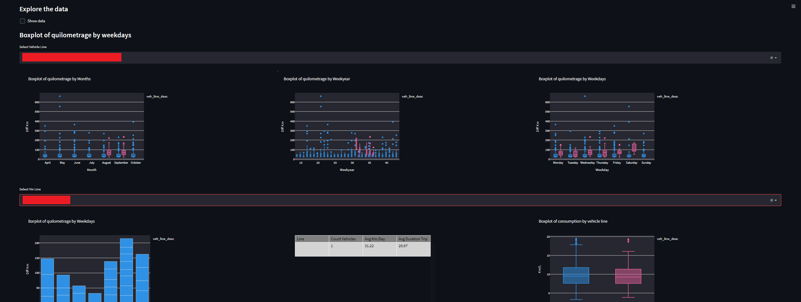

## 🔖 Sobre
Este projeto foi criado com o objetivo de mostrar um dos trabalhos desenvolvidos na pesquisa de Data Science na empresa Ford Company. 
A demanda nasceu da necessidade de se analisar a sazonalidade da distância percorridada por veículos ao longo do ano de 2021.
Por fim de confiabilidade os dados foram anonimizados.

</br>

<p align="center"> 
  
</p>

</br>

## 🚀 Bibliotecas utilizadas

- [Pandas](https://pandas.pydata.org/)
- [Plotly](https://plot.ly/)
- [Pytest](https://www.pytest.org/)

</br>


## 🗂 Estrutura do projeto

```
dashboard_vehicles_analysis
├── __init__.py
|── controller
|    ├── __init__.py
|    ├── chart.py
|    ├── data.py
|    ├── processing.py
├── files
|    ├── readme.png
├──model
|    ├── __init__.py
|    ├── model.py
├── tests
|    ├── __init__.py
|    ├── test_chart.py
|    ├── test_data.py
|   ├── test_model.py
├── .gitignore
├── README.md
├── database.py
├── db.db
├── main.py
└── requirements.txt

```


## 🗂 Como baixar e iniciar o projeto

### Criação do ambiente virtual
Para criar o ambiente virtual, devemos digitar o comando abaixo:
```bash
python  -m venv venv
<env name>\bin\activate

```

Agora, iremos instalar os requirements.txt:
```bash
pip install -r requirements.txt
```

Posterior as configurações iremos configurar o banco de dados, para isso, iremos criar um banco de dados sqlite3 e setar a localização no arquivo database.py:
```python
    import sqlite3
    def connect(self):
        self.connection = sqlite3.connect(r"<NOME DO BANCO CRIADO>")
        self.cursor = self.connection.cursor()
        self.cursor.execute('PRAGMA foreign_keys = ON')
        self.connection.commit() 
```


### Streamlit 💻 
Após a criação do banco e a população com os dados necessários para visualização, iremos rodar o comando abaixo para iniciar a aplicação:

```bash
streamlit run main.py
```

A aplicação irá abrir em um novo navegador e pode ser acessada também pela URL: (https://localhost:8501/)


<br>

Desenvolvido por [Cássio Reis](https://www.linkedin.com/in/cassioreisdevelop/) 🤓


